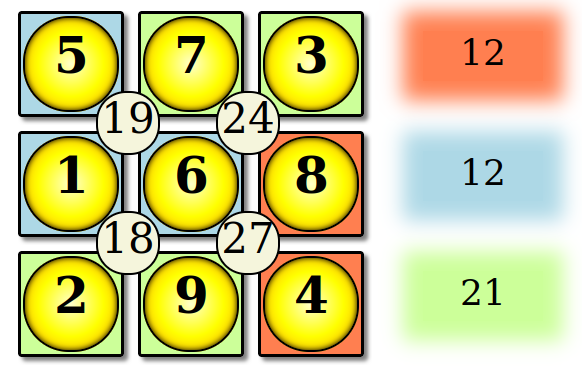

# suko

Suko puzzle solver using constraint programming.

Consider the following (solved) Suko puzzle. The idea is to make the four numbers add up to the total in the middle, and the numbers in the coloured cells add up to the given totals on the right.

*Screenshot taken from https://www.transum.org/software/Puzzles/Suko.asp*

This puzzle is an easy candidate for constraint programming. Check out the solution to this example in `suko.py` which uses the [python-constraints](https://pypi.org/project/python-constraint/) library.